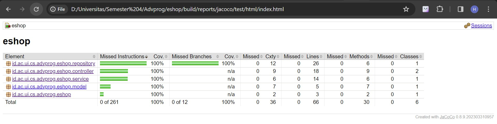

link : https://eshop-henrysoed.koyeb.app/

# Tutorial-2

### 1. List Code Quality Issues dan Strategi:
#### a. Merubah Nama Fungsi yang Kurang Baik
+ Issue: Beberapa fungsi menggunakan snake_case untuk penamaan, padahal Java best practices merekomendasikan camelCase.
+ Strategi: Merubah semua metode yang menggunakan snake_case menjadi camelCase untuk konsistensi dan sesuai dengan konvensi penamaan Java.

#### b. Menghapus Import yang Tidak Diperlukan
+ Issue: Beberapa import tidak digunakan dalam kode.
+ Strategi: Menghapus import yang tidak terpakai untuk membersihkan kode dan meningkatkan keterbacaan.

#### c. Menghapus public access modifier pada interface
+ Issue: Beberapa interface memiliki public access modifier yang tidak perlu.
+ Strategi: Menghapus public access modifier dari interface, karena secara default sudah public.

### 2. Implementasi Saat Ini Memenuhi Definisi CI/CD:

#### a. Automasi CI/CD dengan GitHub Workflows
+ Implementasi saat ini menggunakan GitHub Workflows untuk otomatisasi proses CI/CD.
+ Pengujian otomatis dan pemindaian kode dipicu setiap kali ada push ke repositori, memastikan integrasi berkelanjutan.
+ Penyebaran otomatis ke PaaS Koyeb dan pemeriksaan keamanan kode dilakukan setelah merge berhasil ke branch utama, memenuhi kriteria untuk penyebaran berkelanjutan.

#### b. GitHub Actions untuk Kualitas Kode:
+ Workflows CI mencakup tindakan untuk pemeriksaan kualitas kode seperti PMD dan SonarCloud, memastikan bahwa kode memenuhi standar kualitas sebelum diterapkan.
+ Integrasi berkelanjutan melibatkan serangkaian uji dan pemindaian, memberikan kepercayaan terhadap kualitas kode sebelum beralih ke fase penyebaran.

#### c. Otomatisasi Workflows dalam Siklus Pengembangan Perangkat Lunak:
+ Workflows yang diimplementasikan membentuk proses otomatis dalam Siklus Pengembangan Perangkat Lunak.
+ Proses CI/CD terintegrasi dengan lancar, dari pengujian otomatis dan pemeriksaan kualitas kode hingga penyebaran, meningkatkan efisiensi siklus pengembangan.

### Bonus

----
# Tutorial-1
## Reflection 1
### Implementasi prinsip Clean Code dan Secure Coding
1. Meaningful Names

   Pada tutorial ini, saya menggunakan nama variable dengan makna yang jelas, contohnya productId untuk penamaan ID product, productName untuk penamaan nama product, dan productQuantity untuk kuantitas. Selain itu saya juga membuat nama fungsi jelas dan sesuai tujuan nya seperti create untuk membuat product, edit untuk mengedit nama/kuantitas produk, dan delete untuk menghapus product
2. Functions

   Pada tutorial ini, saya mengimplementasikan prinsip "Function should do one thing. They should do it well. They should do it only" dengan membuat fungsi create, edit, dan delete yang melakukan tugasnya masing-masing di fungsi yang terpisah. Selain itu saya juga menerapkan prinsip "Function should be small" dimana fungsi create,edit, dan delete yang saya buat tidak panjang. Saya juga menerapkan prinsip "Function should have no side effects" dimana fungsi-fungsi yang saya buat tidak memiliki efek samping terhadap fungsi lain nya yang dapat merusak alur program.
3. Comments

   Pada tutorial ini, saya menerapkan prinsip "Don't comment bad code, rewrite it" dimana kode yang saya buat tidak memiliki banyak komentar karena sudah jelas dalam penamaan variable dan fungsinya.
4. Error handling

   Pada tutorial ini, saya menggunakan throw exception untuk mengatasi error.

+ Saya juga mencoba menerapkan prinsip secure coding melalui penggunaan method post untuk membuat suatu product yang baru.

+ Kesalahan yang saya temukan dalam kode saya adalah conflict saat merge. Hal ini dikarenakan kesalahan saya dalam workflow. Setelah saya menyelesaikan branch "list-product", saya membuat 2 branch baru yaitu "edit-product" dan "delete-product". Namun setelah saya selesai dengan branch "edit-product", saya melanjutkan ke branch "delete-product". Hal ini menyebabkan conflict karena ke dua branch tersebut dianggap melakukan modifikasi di tempat yang sama. Untuk menyelesaikan permasalahan ini, saya menggunakan fitur "resolve conflict" di github. Kedepannya saya akan membiasakan melakukan merge terlebih dari sebelum membuat branch baru dan melanjutkan mengerjakan proyek di branch lain.

## Reflection 2
1. Soal 1
+ After writing the unit test, how do you feel?

  Setelah menulis unit test, saya merasa senang karena dapat belajar hal baru. Seorang programer juga harus menguasai unit test agar bisa menguji program yang telah dibuat. Saya juga merasa lebih percaya dengan program yang telah saya buat karena sudah diuji dengan unit test.
+ How many unit tests should be made in a class?

  Tidak ada aturan pasti terkait jumlah unit test, tetapi sebaiknya setiap metode atau fungsi dalam kelas seharusnya memiliki setidaknya satu unit test yang mencakup skenario pengujian yang signifikan.
+ How to make sure that our unit tests are enough to verify our program?

  Untuk memastikan bahwa unit test cukup untuk memverifikasi program kita dengan memastikan bahwa semua jalur eksekusi kode telah diuji dan sudah mencakup expected behavior, potential errors, boundary errors, dan edge cases.
+ If you have 100% code coverage, does that mean your code has no bugs or errors?

  100% code coverage tidak menjamin bahwa kode tidak memiliki bug atau kesalahan. Code coverage hanya mengukur sejauh mana kode dieksekusi selama pengujian, namun tidak memberikan informasi tentang kebenaran logika atau keakuratan implementasi. Kualitas pengujian lebih ditentukan oleh kasus uji yang dipilih dan sejauh mana kasus-kasus tersebut mencakup kondisi ekstrem dan situasi tidak valid yang mungkin menyebabkan bug.

2. What do you think about the cleanliness of the code of the new functional test suite? Will the new code reduce the code quality?

   Menurut saya, perlu diperhatikan kebersihan kode saat pembuatan functional test suite baru. Hal ini dapat membantu developer dalam memelihara dan memaintain kode. Selain itu perlu juga diperhatikan potensi duplikasi kode dengan functional test suites sebelumnya. Hal ini dapat mengurangi kualitas kode karena tidak menggunakan prinsip dari clean code yang menyusahkan developer untuk memaintain kode.

